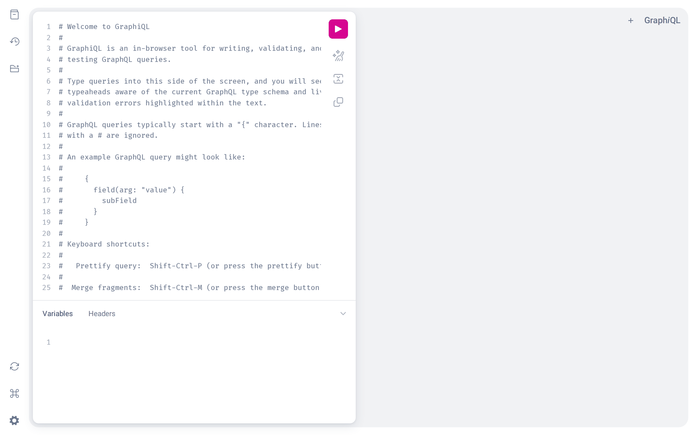

# Django GraphQL Template

A minimal Django + Graphene starter showing a complete GraphQL CRUD setup on a
single `Product` model: one query, three mutations, and the GraphiQL explorer
enabled for development.

## Stack

- Django 6.1
- Graphene 3.4 / graphene-django 3.2
- django-cors-headers
- django-environ (settings read from `.env`)
- SQLite (development default)

## Getting started

```bash
python -m venv .venv
.venv/bin/pip install -r requirements.txt

cp .env.example .env          # then set SECRET_KEY

.venv/bin/python manage.py migrate
.venv/bin/python manage.py runserver
```

Open the GraphiQL explorer at http://127.0.0.1:8000/graphql/

## What you get

The GraphiQL explorer at `/graphql/`, with the schema, docs and autocomplete
that Graphene generates from the models.



## API

```graphql
# query
{ allProducts { id title price stock } }

# mutations
mutation { createProduct(title: "Laptop", price: 1200, stock: 5) { message } }
mutation { updateProduct(id: 1, price: 1100) { message } }
mutation { deleteProduct(id: 1) { message } }
```

## Layout

```
apps/            # Product model and the GraphQL schema (queries + mutations)
apps/schema.py   # ProductType, Query, CreateProduct / UpdateProduct / DeleteProduct
core/            # project settings, urls, wsgi/asgi
manage.py
```

## Environment variables

| Variable | Description |
|---|---|
| `SECRET_KEY` | Django secret key (required) |
| `DEBUG` | Debug mode, `True` / `False` (default `True`) |
| `ALLOWED_HOSTS` | Comma-separated hosts (default `localhost,127.0.0.1`) |
